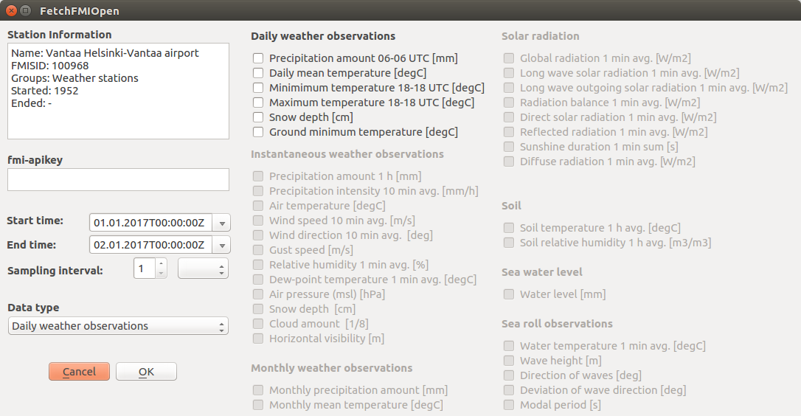

# FetchFMIOpen
A QGIS plugin to download meteorological observation data from the FMI open data archive.

### Overview
This [QGIS](https://www.qgis.org/en/site/) plugin provides a tool to download meteorological observation data from the [Finnish
Meteorological Institute](https://en.ilmatieteenlaitos.fi/) (FMI) [open data archive](https://en.ilmatieteenlaitos.fi/open-data).

Most of the observational point data available from the open data archive is downloadable using the plugin. Available datasets include:
- Daily weather observations
- Instantaneous weather observations
- Monthly weather observations
- Solar radiation observations
- Soil parameter observations
- Sea water level, temperature and wave observations
- Road weather observations from [Finnish Transport Agency](https://fta.fi) road weather stations

### Instructions
After the introduction of QGIS 3.4, there are now two versions of the tool available depending on whether QGIS 2.x.x or 3.x.x is being used. Download the version of the tool corresponding to your version of QGIS.

#### Getting data  
1. Extract the contents of FetchFMIOpen_QGISv3.zip or FetchFMIOpen_QGISv2.zip to the QGIS plugin folder.  
The default locations of QGIS plugin folders on Linux, Mac and Windows are (for QGIS v3.X OR v2.X):
  * \~/.local/share/QGIS/QGIS3/profiles/default/python/plugins/ OR \~/.qgis2/python/plugins/ (Linux, Mac)
  * C:\Users\USERNAME\\AppData\Roaming\QGIS\QGIS3\profiles\default\python\plugins OR C:\Users\USERNAME\\.qgis2\python\plugins\\   (Windows)
2. Extract the contents of fmi_stations.zip
3. In QGIS, enable the FetchFMIOpen plugin
4. Add e.g. fmi_weather_stations.shp to a project
5. Select a single feature (station) from the fmi_weather_stations.shp and using the FetchFMIOpen plugin download the weather observation data from the station.

Note that some stations only provide certain observations. E.g. solar radiation observations are only available from Sodankylä, Jokioinen, Helsinki, Parainen, Vantaa, Jyväskylä, Sotkamo and Utsjoki stations, the sea level observations from the mareographs, and the wave etc. observations from buoys.  

#### Traffic station information
Current Finnish Transport Agency road weather stations can be aquired using script get_livi_stations.py.  
The script requires following non-standard Python packages (easily installed using e.g. [Anaconda](https://www.anaconda.com/download/#linux)): [pandas](https://anaconda.org/anaconda/pandas), [geopandas](https://anaconda.org/conda-forge/geopandas), [shapely](https://anaconda.org/anaconda/shapely).

### Map data
- QGIS can show e.g. OpenStreetMap or Google Map layers through the [OpenLayers Plugin](http://hub.qgis.org/projects/openlayers/wiki) which can help locating the FMI measurement stations on a map (Web -> OpenLayers plugin -> OpenStreetMap)
- E.g. National Land Survey of Finland (Maanmittauslaitos) has opened maps and other spatial datasets that can help locating the FMI measurement stations ([https://www.avoindata.fi/data/en/dataset](https://www.avoindata.fi/data/en/dataset))
